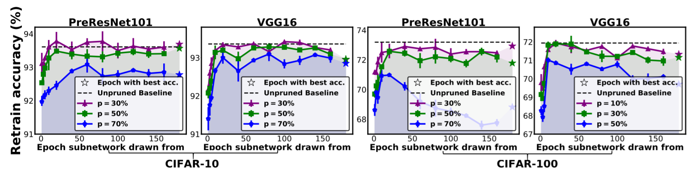
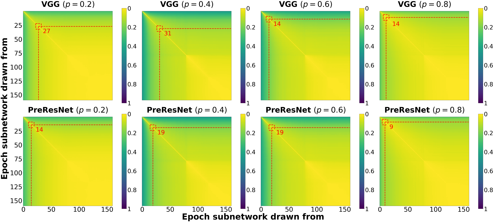
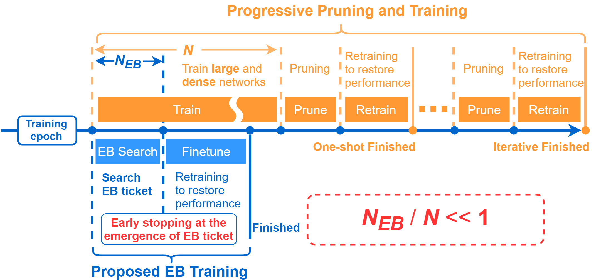
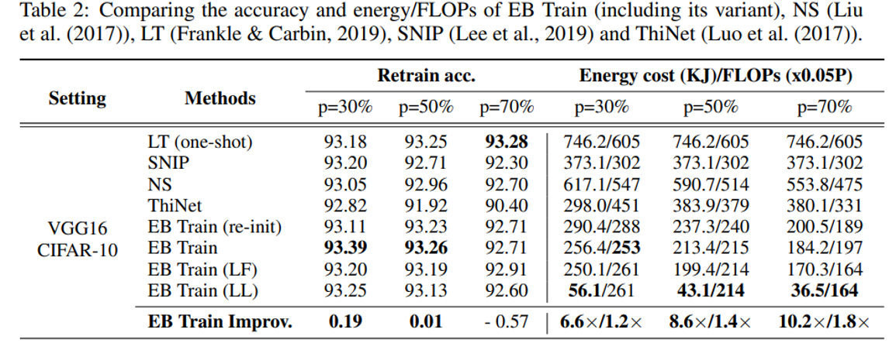

# Early-Bird-Tickets

[](https://openreview.net/group?id=ICLR.cc/2020/Conference#accept-spotlight)
[](https://opensource.org/licenses/MIT)

This is PyTorch implementation of [Drawing Early-Bird Tickets: Toward More Efficient Training of Deep Networks](https://arxiv.org/abs/1909.11957)

ICLR 2020 spotlight oral paper

## Table of Content
<!-- [TOC] -->
<div class="toc">
<ul>
<li><a href="#early-bird-tickets">Early-Bird-Tickets</a><ul>
<li><a href="#table-of-content">Table of Content</a></li>
<li><a href="#introduction">Introduction</a></li>
<li><a href="#early-bird-tickets_1">Early-Bird Tickets</a><ul>
<li><a href="#existence-of-early-bird-tickets">Existence of Early-Bird Tickets</a></li>
<li><a href="#identify-early-bird-tickets">Identify Early-Bird Tickets</a></li>
<li><a href="#efficient-training-via-early-bird-tickets">Efficient Training via Early-Bird Tickets</a></li>
</ul>
</li>
<li><a href="#basic-usage">Basic Usage</a><ul>
<li><a href="#prerequisites">Prerequisites</a></li>
<li><a href="#core-training-options">Core Training Options</a></li>
<li><a href="#standard-train-for-identifying-early-bird-tickets">Standard Train for Identifying Early-Bird Tickets</a></li>
<li><a href="#retrain-to-restore-accuracy">Retrain to Restore Accuracy</a></li>
<li><a href="#low-precision-search-and-retrain">Low Precision Search and Retrain</a></li>
</ul>
</li>
<li><a href="#imagenet-experiments">ImageNet Experiments</a><ul>
<li><a href="#resnet18-on-imagenet">ResNet18 on ImageNet</a></li>
<li><a href="#resnet50-on-imagenet">ResNet50 on ImageNet</a></li>
</ul>
</li>
<li><a href="#citation">Citation</a></li>
<li><a href="#acknowledgement">Acknowledgement</a></li>
</ul>
</li>
</ul>
</div>

## Introduction

- **[Lottery Ticket Hypothesis](https://openreview.net/forum?id=rJl-b3RcF7)**: (Frankle & Carbin, 2019) shows that there exist winning tickets (small but critical subnetworks) for dense, randomly initialized networks, that can be trained alone to achieve comparable accuracies to the latter in a similar number of iterations.

- **Limitation**: However, the identification of these winning tickets still requires the costly train-prune-retrain process, limiting their practical benefits.

- **Our Contributions**:
    + We discover for the first time that the winning tickets can be identified at the very early training stage, which we term as early-bird (EB) tickets, via low-cost training schemes (e.g., early stopping and low-precision training) at large learning rates. Our finding of EB tickets is consistent with recently reported observations that the key connectivity patterns of neural networks emerge early.
    + Furthermore, we propose a mask distance metric that can be used to identify EB tickets with low computational overhead, without needing to know the true winning tickets that emerge after the full training.
    + Finally, we leverage the existence of EB tickets and the proposed mask distance to develop efficient training methods, which are achieved by first identifying EB tickets via low-cost schemes, and then continuing to train merely the EB tickets towards the target accuracy.

Experiments based on various deep networks and datasets validate: 1) the existence of EB tickets, and the effectiveness of mask distance in efficiently identifying them; and 2) that the proposed efficient training via EB tickets can achieve up to 4.7x energy savings while maintaining comparable or even better accuracy, demonstrating a promising and easily adopted method for tackling cost-prohibitive deep network training.

## Early-Bird Tickets

### Existence of Early-Bird Tickets
To articulate the Early-Bird (EB) tickets phenomenon: the winning tickets can be drawn very early in training, we perform ablation simulation using two representative deep models (VGG16 and PreResNet101) on two popular datasets (CIFAR10 and CIFAR100). Specifically, we follow the main idea of [(Frankle & Carbin, 2019)](https://openreview.net/forum?id=rJl-b3RcF7) but instead prune networks trained at earlier points to see if reliable tickets can be drawn. We adopt the same channel pruning in [(Liu et al., 2017)](http://openaccess.thecvf.com/content_iccv_2017/html/Liu_Learning_Efficient_Convolutional_ICCV_2017_paper.html) as pruning techniuqes for all experiments since it aligns with our end goal of efficient trianing. Below figure demonstrates the existence of EB tickets. (p = 30% means 30% weights are pruned)



### Identify Early-Bird Tickets
we visialize distance evolution process among the tickets drawn from each epoch.
Below figure plots the pairwise mask distance matrices (160 x 160) of the VGG16 and PreResNet101 experiments on CIFAR100 at different pruning ratio `p`, where `(i, j)-th` element in a matrix denotes the mask distance between epochs `i` and `j` in that corresponding experiment. A lower distance (close to 0) indicates a smaller mask distance and is colored warmer.

<!--  -->
<div align=center>
    
</div>

Our observation that the ticket masks quickly become stable and hardly changed in early training stages supports drawing EB tickets. We therefore measure the mask distance consecutive epochs, and draw EB tickets when such distance is smaller than a threshold.
Practically, to improve the reliability of EB tickets, we will stop to draw EB tickets when the last five recorded mask distances are all smaller than given threshold.

### Efficient Training via Early-Bird Tickets
Instead of adopting a three-step routine of 1) training a dense model, 2) pruning it and 3) then retraining the pruned model to restore performance, and these three steps can be iterated, we leverage the existence of EB tickets to develop EB Train scheme which replaces the aforementioned steps 1 and 2 with a lower-cost step of detecting the EB tickets.
<!--  -->
<div align=center>
    
</div>
<br>

## Basic Usage
### Prerequisites
The code has the following dependencies:

- python 3.7
- pytorch 1.1.0
- torchvision 0.3.0
- Pillow (PIL) 5.4.1
- scipy 1.2.1
- [qtorch](https://github.com/Tiiiger/QPyTorch) 0.1.1 (for low precision)
- GCC >= 4.9 on linux (for low precision)

### Core Training Options
- `dataset`: which dataset you want to use CIFAR10/100 by default
- `data`: If you want to use ImageNet, plz specified the path to raw data
- `batch-size`: all exps use 256 by default in paper
- `epochs`: total epochs, 160 in total
- `schedule`: at which points the learning rate degraded, use [80, 120] by default
- `lr`: initial learning rate, 0.1 by default
- `save`: save checkpoints to the specific directory
- `arch`: which model you want to use, support vgg and resnet now
- `depth`: model depth
- `filter`: apply filter to dataset, default is none
- `sparsify_gt`: sparify the dataset with given percentage
- `gpu_ids`: multi-gpus is supported


### Standard Train for Identifying Early-Bird Tickets
* e.g., for VGG16 performed on CIFAR-100

````
CUDA_VISIBLE_DEVICES=0 python main.py \
    --dataset cifar100 \
    --arch vgg \
    --depth 16 \
    --lr 0.1 \
    --epochs 160 \
    --schedule 80 120 \
    --batch-size 256 \
    --test-batch-size 256 \
    --save ./baseline/vgg16-cifar100 \
    --momentum 0.9 \
    --sparsity-regularization
````

* real prune the saved checkpoints

````
python vggprune.py \
--dataset cifar100 \
--test-batch-size 256 \
--depth 16 \
--percent 0.3 \
--model ./baseline/vgg16-cifar100/EB-30-35.pth.tar \
--save ./baseline/vgg16-cifar100/pruned_3035_0.3 \
--gpu_ids 0
````

### Retrain to Restore Accuracy
* e.g., for VGG16 performed on CIFAR-100 (finetune)

````
CUDA_VISIBLE_DEVICES=0 python main_c.py \
--dataset cifar100 \
--arch vgg \
--depth 16 \
--lr 0.1 \
--epochs 160 \
--schedule 80 120 \
--batch-size 256 \
--test-batch-size 128 \
--save ./baseline/vgg16-cifar100/retrain_1035_0.1 \
--momentum 0.9 \
--sparsity-regularization \
--scratch ./baseline/vgg16-cifar100/pruned_1035_0.1/pruned.pth.tar \
--gpu_ids 0 \
--start_epoch 35
````

* e.g., for VGG16 performed on CIFAR-100 (from scratch)

````
CUDA_VISIBLE_DEVICES=0 python main_scratch.py \
--dataset cifar100 \
--arch vgg \
--depth 16 \
--lr 0.1 \
--epochs 160 \
--schedule 80 120 \
--batch-size 256 \
--test-batch-size 128 \
--save ./baseline/vgg16-cifar100/retrain_1035_0.1_scratch \
--momentum 0.9 \
--sparsity-regularization \
--scratch ./baseline/vgg16-cifar100/pruned_1035_0.1/pruned.pth.tar \
--gpu_ids 0
````

### Low Precision Search and Retrain
We perform low precision method [SWALP](https://arxiv.org/pdf/1904.11943.pdf) to both the search and retrian stages, e.g., for VGG16 performed on CIFAR-10.

* search stage:

````
CUDA_VISIBLE_DEVICES=0 python main_lp.py \
    --dataset cifar10 \
    --arch vgg \
    --depth 16 \
    --lr 0.1 \
    --epochs 160 \
    --schedule 80 120 \
    --batch-size 256 \
    --test-batch-size 256 \
    --save ./lp_baseline/vgg16-cifar10 \
    --momentum 0.9 \
    --sparsity-regularization \
    --swa True \
    --swa_start 140 \
    --wl-weight 8 \
    --wl-grad 8 \
    --wl-activate 8 \
    --wl-error 8 \
    --wl-momentum 8 \
    --rounding stochastic
````

* real prune the saved checkpoints:

````
CUDA_VISIBLE_DEVICES=0 python vggprune_lp.py \
    --dataset cifar10 \
    --test-batch-size 256 \
    --depth 16 \
    --percent 0.3 \
    --model ./lp_baseline/vgg16-cifar10/EB-30-32.pth.tar \
    --save ./lp_baseline/vgg16-cifar10/pruned_3032_0.3 \
    --wl-weight 8 \
    --wl-grad 8 \
    --wl-activate 8 \
    --wl-error 8 \
    --wl-momentum 8 \
    --rounding stochastic
````

* retrain to restore accuracy:

````
CUDA_VISIBLE_DEVICES=0 python main_c_lp.py \
--dataset cifar10 \
--arch vgg \
--depth 16 \
--lr 0.1 \
--epochs 160 \
--schedule 80 120 \
--batch-size 256 \
--test-batch-size 128 \
--scratch ./lp_baseline/vgg16-cifar10/pruned_3032_0.3/pruned.pth.tar \
--save ./lp_baseline/vgg16-cifar10/lp_retrain_3032_0.3 \
--start_epoch 32 \
--momentum 0.9 \
--sparsity-regularization \
--swa True \
--swa_start 140 \
--wl-weight 8 \
--wl-grad 8 \
--wl-activate 8 \
--wl-error 8 \
--wl-momentum 8 \
--rounding stochastic
````

* comparison example

<div align=left>
    
</div>

## ImageNet Experiments
All pretrained checkpoints of different pruning ratio have been collected in [Google Drive](https://drive.google.com/open?id=1aTl47KR8oaHkOxqKOUDgQyI96dW7JgHJ). To evaluate the inference accuracy of test set, we provide evaluation scripts ( `EVAL_ResNet18_ImageNet.py` and `EVAL_ResNet50_ImageNet.py` ) and corresponding commands shown below for your convenience.

````
python EVAL_ResNet18_ImageNet.py \
--dataset imagenet \
--data /data3/imagenet-data/raw-data \
--arch resnet18 \
--depth 18 \
--lr 0.1 \
--epochs 90 \
--schedule 30 60 \
--batch-size 128 \
--test-batch-size 64 \
--save ./EBTrain-ImageNet/ResNet18/temp \
--resume ./EBTrain-ImageNet/ResNet18/retrain_1011_0.1/model_best.pth.tar \
--scratch ./EBTrain-ImageNet/ResNet18/pruned_1011_0.1/pruned.pth.tar \
--momentum 0.9 \
--sparsity-regularization \
--gpu_ids 4
````

````
python -m torch.distributed.launch EVAL_ResNet50_ImageNet.py \
--dataset imagenet \
--data /data3/imagenet-data/raw-data \
--arch resnet50_prune \
--depth 50 \
--lr 0.1 \
--epochs 90 \
--schedule 30 60 \
--batch-size 128 \
--test-batch-size 128 \
--save ./EBTrain-ImageNet/ResNet50/temp \
--scratch ./EBTrain-ImageNet/ResNet50/pruned_3010_0.3/pruned.pth.tar \
--resume ./EBTrain-ImageNet/ResNet50/retrain_3010_0.3/model_best.pth.tar \
--momentum 0.9 \
--gpu_ids 0,1,2,3
````

### ResNet18 on ImageNet
* search for EB tickets
````
CUDA_VISIBLE_DEVICES=0 python main.py \
--dataset imagenet \
--data /data3/imagenet-data/raw-data \
--arch resnet18 \
--depth 18 \
--lr 0.1 \
--epochs 90 \
--schedule 30 60 \
--batch-size 256 \
--test-batch-size 64 \
--save ./EBTrain-ImageNet/ResNet18 \
--momentum 0.9 \
--sparsity-regularization
````
* real prune the EB tickets
````
CUDA_VISIBLE_DEVICES=5 python resprune.py \
--dataset imagenet \
--data /data3/imagenet-data/raw-data \
--arch resnet18 \
--test-batch-size 128 \
--depth 18 \
--percent 0.3 \
--model ./EBTrain-ImageNet/ResNet18/EB-30-11.pth.tar \
--save ./EBTrain-ImageNet/ResNet18/pruned_3011_0.3 \
````
* retrain to restore accuracy
````
CUDA_VISIBLE_DEVICES=3 python main_c.py \
--dataset imagenet \
--data /data3/imagenet-data/raw-data \
--arch resnet18 \
--depth 18 \
--lr 0.1 \
--epochs 90 \
--schedule 30 60 \
--batch-size 128 \
--test-batch-size 64 \
--save ./EBTrain-ImageNet/ResNet18/retrain_1011_0.1 \
--momentum 0.9 \
--sparsity-regularization \
--scratch ./EBTrain-ImageNet/ResNet18/pruned_1011_0.1/pruned.pth.tar \
--start-epoch 11
````

* comparison results
<div align=left>
    
</div>

### ResNet50 on ImageNet
* search for EB tickets
````
python -m torch.distributed.launch main_resnet50.py \
--dataset imagenet \
--data /data3/imagenet-data/raw-data \
--arch resnet50_official \
--depth 50 \
--lr 0.1 \
--epochs 90 \
--schedule 30 60 \
--batch-size 256 \
--test-batch-size 64 \
--save ./EBTrain-ImageNet/ResNet50 \
--momentum 0.9 \
--sparsity-regularization \
--gpu_ids 0,1,2,3
````
* real prune the EB tickets
````
python resprune_50.py \
--dataset imagenet \
--data /data3/imagenet-data/raw-data \
--arch resnet50_official \
--test-batch-size 128 \
--depth 50 \
--percent 0.7 \
--model ./EBTrain-ImageNet/ResNet50/EB-70-8.pth.tar \
--save ./EBTrain-ImageNet/ResNet50/pruned_7008_0.7
````
* retrain to restore accuracy
````
python -m torch.distributed.launch main_resnet50.py \
--dataset imagenet \
--data /data3/imagenet-data/raw-data \
--arch resnet50_prune \
--depth 50 \
--lr 0.1 \
--epochs 90 \
--schedule 30 60 \
--batch-size 256 \
--test-batch-size 128 \
--save ./EBTrain-ImageNet/ResNet50/retrain_7008_0.7 \
--scratch ./EBTrain-ImageNet/ResNet50/pruned_7008_0.7/pruned.pth.tar \
--momentum 0.9 \
--gpu_ids 4,5,6,7 \
--port 14000 \
--start-epoch 8
````


## Citation

If you find this code is useful to your research, please cite:
````
@inproceedings{
you2020drawing,
title={Drawing Early-Bird Tickets: Toward More Efficient Training of Deep Networks},
author={Haoran You and Chaojian Li and Pengfei Xu and Yonggan Fu and Yue Wang and Xiaohan Chen and Yingyan Lin and Zhangyang Wang and Richard G. Baraniuk},
booktitle={International Conference on Learning Representations},
year={2020},
url={https://openreview.net/forum?id=BJxsrgStvr}
}
````

## Acknowledgement
* Code is inspired by [Rethink-Network-Pruning](https://github.com/Eric-mingjie/rethinking-network-pruning).
* Thank for the constructive suggestions of [Yifan](https://github.com/yueruchen) and [Tianlong](https://github.com/TianlongChenTAMU) ...
* Thank [Yifan](https://github.com/yueruchen) for helping accelerate ImageNet training.
